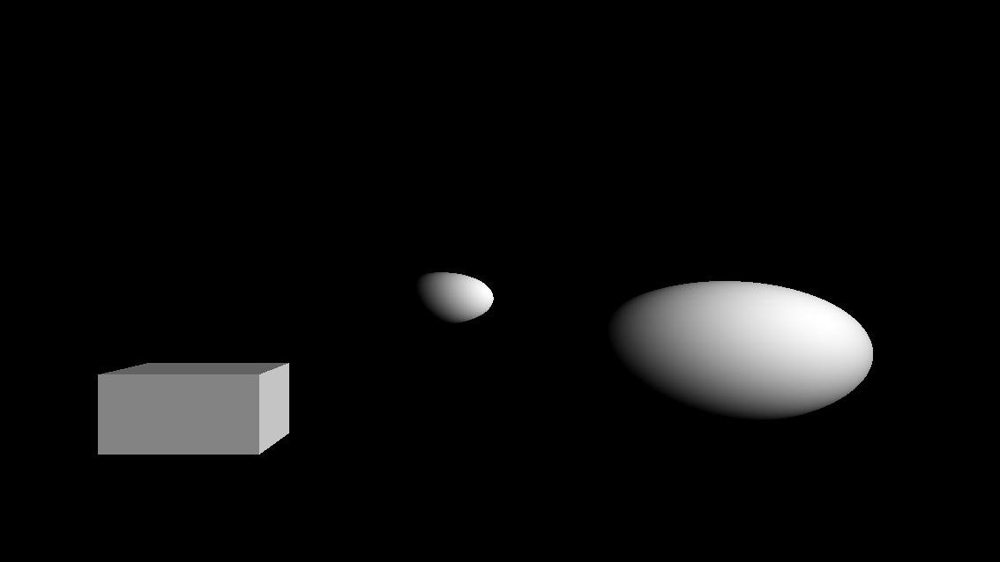
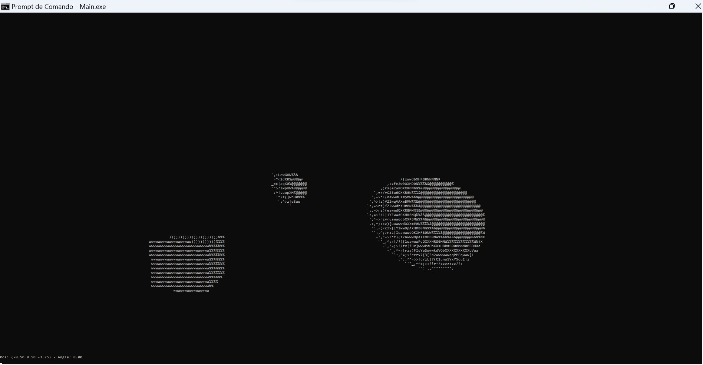

# ASCII Raytracer

An ASCII Raytracer (and Raymarcher) written in pure C that renders on the terminal usign ASCII characters

---

Original:

ASCII Raytracer:

### KEYS

`W` `A` `S` `D` => Movement

`SPACE` `Z` => UP and DOWN

`O` `P` => Camera Y axis rotation

### Resolution 

The resolution is dependent on the Hard Coded Macros `WINDOW_WIDTH` and `WINDOW_HEIGHT` as well as the terminal size, font and window
